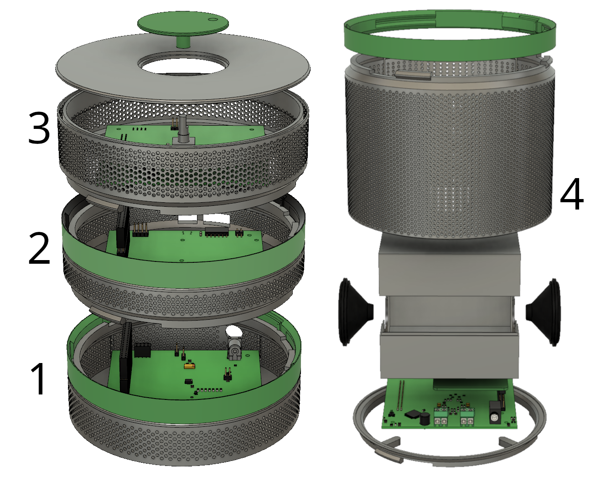

# FreeSpeaker

This repository provides the current state of our modular smart speaker research platform called **FreeSpeaker**.

### :warning: Work in progress
The current state of the FreeSpeaker is a first beta version.
We plan to update the design and add changes that will lead to incompatibilities with current hardware.

## Mechanical design
[![CC BY 4.0][cc-by-shield]][cc-by]

Find the CAD files for the plattform in `mechanical_design/`.
The components were designed to be 3D printed.

Tools: Autodesk Fusion 360 or any CAD program compatible with STEP files.

The CAD files are licensed under a [Creative Commons Attribution 4.0 International License][cc-by].

## PCB design
[![CC BY 4.0][cc-by-shield]][cc-by]
Find the design files for the PCB in `electric_design/`.

Tools: KiCad 6.x

The electrical design files are licensed under a [Creative Commons Attribution 4.0 International License][cc-by].

## Software 
[![MIT][mit-shield]][mit]
Find scripts to setup the different components in `software/`.

The software components are licensed under a [MIT License][mit].

---

The following demo paper was send to review at [MobiCom 2023](https://www.sigmobile.org/mobicom/2023/demos.html).

---

## Demo: Introducing FreeSpeaker -- A Modular Smart Home Hub Prototyping Platform
Smart home speakers have become a commodity item in many households and provide interesting research opportunities in areas like wireless communication and human-computer interaction.
Commercial devices do not provide sufficient access for many research tasks.
We present a modular smart home hub designed specifically for research purposes.
The electronic and mechanical components are designed with reproducibility in mind and can be easily recombined for a project's needs.
Additionally, we show applications of the hub in different scenarios.
  
### Introduction

Exploded view: On the left a stack of power supply (1), mainboard (2), and on top the UI (3). On the right (4), separately and in greater detail, the module with the speaker drivers for audio output.

Smart home speakers like Amazon Alexa or Google Nest have become increasingly popular in the last years.
This sparks interest to use them for investigating topics such as acoustic communication, evaluating new wireless communication schemes, or studying novel human-computer-interaction patterns
\[ [1](https://doi.org/10.1109/INFOCOM.2015.7218629),
[2](https://doi.org/10.1109/TMM.2017.2766049),
[3](https://doi.org/10.1109/MPRV.2003.1228528),
[4](https://doi.org/10.1145/2462456.2464437),
[5](https://doi.org/10.1007/978-3-540-39653-6_25) \].
While commercial speakers are cheap and readily available for consumers, their closed nature does not provide a suitable platform for research.
Neither their hardware nor software documentation is publicly available and researchers cannot run arbitrary experiments on them.
Some attempts to reverse engineer commercial smart speakers have been successful
[6](https://andrerh.gitlab.io/echoroot/) but a fully open hardware platform would still benefit the research community.
Additionally, features not available in commercial devices like special radio protocols can be implemented, if needed.
A modular system helps with this, as new functionality can be added easily.

In this demo, we show such a modular platform called FreeSpeaker based on a Raspberry Pi Compute Module 4 (CM4).
We designed and built the electronics for this system including the basic modules implementing the functionality of modern smart speakers.
We publish the current state of the design files for electronics and mechanical parts as well as scripts for setting up the system on GitHub. (this repo)

### Design
Different components to run the smart home hub are split into modules that can be reassembled without any tools.
So far we implemented a power supply module, the mainboard containing the CM4, a speaker and microphone array combination, and a user interface with LEDs and a rotary encoder.
Additionally, we provide a prototyping module with a small breadboard on top.
Reproducibility of the hardware was a main concern to enable other researchers to build their own hardware.
Therefore, the electronics are designed to be easily produced and assembled by major PCB prototyping companies, need only minor additional work and no special tools other than soldering equipment.
The enclosure is designed for 3D printing since it provides a cheap way to produce low volumes of plastic parts.

#### Electronic Design
During PCB development, we ensured that boards can be manufactured with easily accessible soldering tools.
Each signal is accessible via test pads and soldering bridges to enable changes on the PCB without reordering.
The main controller module is a [CM4](https://www.raspberrypi.com/products/compute-module-4/) that provides CPU, RAM, and storage available in different configurations.
The mainboard supports a serial console and Ethernet.
We used the same connector on all modules to provide power and to allow communication between the modules and the mainboard.
Each module connects to a bus that enables hardware identification and in-circuit firmware updates.

#### Mechanical Design
Each module of the hub has a round, stackable enclosure.
We designed a tool-free mechanism with a lock ring to hold the modules together.
Additionally, the mechanism aligns the modules' electrical contacts and ensures their correct orientation.

#### Software Design
We chose the CM4 to benefit from the large and well-maintained software repositories of the Raspberry Pi ecosystem.
We provide an install script that sets Linux Device Tree parameters and installs required drivers to use the custom hardware setup.
Then, researchers can install additional packages as required by their project.

### Applications
Our hardware platform enables researchers to build proofs of concept.
During first demonstrations, participants easily recognized the device as a Smart Speaker.
This allows researchers to focus on the new application rather than explaining the intended environment.
The following sections give a short overview of running projects using the device.

#### Public Warning Systems in Smart Homes
In the living lab [*eHUB*](https://www.emergencity.de/missions/ehub/), the FreeSpeaker is integrated into the smart home setup.
Our device is one of multiple actors in the house which all connect to a local MQTT broker.
The UI of the FreeSpeaker is available to the main controller of the house and enables inhabitants or guests to control the smart home system.
Currently, we use the speaker and an electronic paper display in the eHUB in combination to provide visual and audible information.

#### Secure Bootstrapping Using Acoustic Communication
Scheck et al. [7](https://doi.org/10.26083/tuprints-00024180) used the FreeSpeaker to implement a secure pairing process with an acoustic out-of-band channel.
While commercially available smart speakers theoretically provide the required hardware for acoustic pairing, software access to them is too restricted.
The FreeSpeaker enabled them to demonstrate their protocol on a device similar to available smart speakers.

### Future Work
We demonstrated the general viability of our smart speaker as a research platform with a flexible mechanical design and modular swappable components, while still being easy to assemble.
Based on our experience with the first platform revision, we plan to redesign the PCB and signal routing to support future extensions of our platform with improved modules for battery, display, and wireless protocols.
This PCB redesign will result in incompatibilities, whereas our mechanical design remains compatible.

---
This work has been funded by the LOEWE initiative (Hesse, Germany) within the emergenCITY center.

[cc-by]: https://creativecommons.org/licenses/by/4.0/
[cc-by-shield]: https://img.shields.io/badge/License-CC%20BY%204.0-lightgrey.svg
[mit-shield]: https://img.shields.io/badge/License-MIT-lightgrey.svg
[mit]: https://opensource.org/license/mit/
